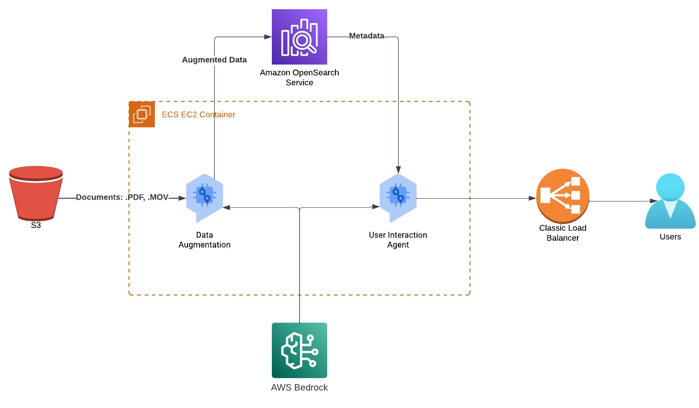
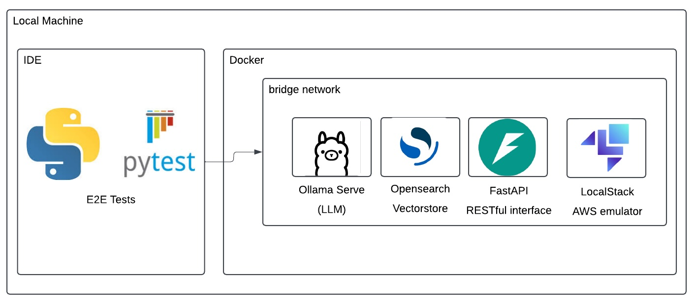
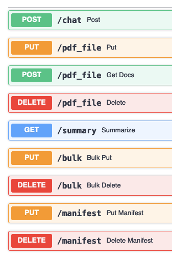

# New Math Data AWS GenAI RAG Quick Start

This Quick Start will help you create an end-to-end local development environment to accelerate your AWS RAG development. 

The Quick Start provides functionality for working with unstructured content, such as:
- Metadata augmentation
- Metadata storage via OpenSearch
- Document retrieval via an LLM agent

To make your life easier, the Quick Start includes:
- A local LLM for rapid prototyping
- LocalStack for AWS services
- OpenSearch
- FastAPI for local E2E functional testing
- CLI interface for direct command-line usage
- Terraform configurations to deploy a production-ready stack
**_NOTE:_** the local LLM is small and not multimodal, so it doesn't do well on image Q&A

# AWS RAG Architectural Pattern


# Local Testing


## Prerequisites
- Python 3.11 or higher
- Docker and docker-compose.
  - Be sure to max out resource allocation in Docker preferences, you'll need it.
- Homebrew (or your favorite package manager, substitute brew [something] commands as necessary).
- [uv](https://github.com/astral-sh/uv) for Python package management
- This repo, cloned locally. Duh.

## Testing
### Install dependencies
```bash
# Install uv if you haven't already
pip install uv

# Install the package and its dependencies
uv pip install -e .

# Install development dependencies
uv install -e ".[dev]"
```
[Terraform](https://developer.hashicorp.com/terraform) is required for obvious reasons
```bash
brew tap hashicorp/tap
brew install hashicorp/tap/terraform
```
[TFLint](https://github.com/terraform-linters/tflint) is required for terraform_tflint hook
```bash
brew install tflint
```
[Hadolint](https://github.com/hadolint/hadolint) is required for hadolint hook
```bash
brew install hadolint
```
### Run unit tests
```bash
python -m pytest tests/unit_tests.py
```
### Run coverage
```bash
coverage erase && \
coverage run -m pytest tests/unit_tests.py && \
coverage report --show-missing
```
### Linting
```bash
black -l79 src tests
isort -l79 --profile black src tests
pylama src tests
tflint
terraform fmt
```
### Pre-commit
```bash
pre-commit install
pre-commit run --all-files
```
### Local Functional Testing Steps
1. Run:
```bash
docker-compose up -d --build 
```
2. Navigate to http://0.0.0.0/docs
3. Test Each interface



### Index State
To check the index state:  
- Navigate to the local OpenSearch dashboard http://localhost:5601/app/home#/  
- From menu on the left, go to Index management > Indexes

# CLI Usage

The package provides a command-line interface for interacting with the RAG system. After installation, the CLI is available as `aws-rag`.

## Environment Variables

The CLI automatically loads environment variables from a `.env` file in the current directory. You can also specify a custom environment file:

```bash
aws-rag --env-file /path/to/custom/.env <command>
```

## Available Commands

### Ingest a Document
```bash
aws-rag ingest --unique-id <id> --file-path <path>
```

### Delete a Document
```bash
aws-rag delete --unique-id <id> --file-path <path>
```

### List Documents
```bash
aws-rag list-docs <unique_id1> <unique_id2> ...
```

### Ask a Question
```bash
aws-rag chat <unique_id1> <unique_id2> ... --question "Your question here"
```

### Generate Document Summaries
```bash
aws-rag summarize <unique_id1> <unique_id2> ...
```

### Bulk Document Ingestion
```bash
aws-rag bulk-ingest --unique-id <batch_id> <file_path1> <file_path2> ...
```

### Ingest Documents from a Manifest
```bash
aws-rag ingest-manifest --manifest-path <path_to_manifest.json> --unique-id <batch_id>
```

## Getting Help
```bash
aws-rag --help
aws-rag <command> --help
```

# Deploy
## Credentials
We use saml2aws
```bash
brew install saml2aws
saml2aws configure 
saml2aws login 
```
## Terraform Remote State
```bash
cd terraform/remote_state
terraform init
terraform apply
```
### Terraform Deploy
```bash
cd ../live/dev
terraform init
terraform apply --auto-approve
```
terraform.tfvars values
```bash
account_id="aws_account_id"
bedrock_image_uri="aws_account_id.dkr.ecr.region_name.amazonaws.com/aws-rag/bedrock:latest"
opensearch_image_uri="aws_account_id.dkr.ecr.us-east-1.amazonaws.com/aws-rag/opensearch:latest"
ecs_opensearch_image_uri="aws_account_id.dkr.ecr.region_name.amazonaws.com/aws-rag/ecsopensearch:latest"
region_name="us-east-1"
customer="Test" # for tagging
creator="cking" # for tagging
```

